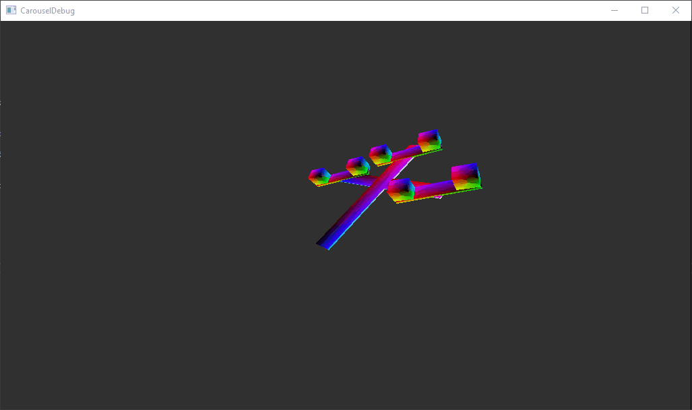

# TDsEngine

## Quick Start
Building project :

First Step go to the TDsEngine directory : 

`cd TDsEngine`

Generate Visual Studio 2017 project files : 

`.\externals\bx\tools\bin\windows\genie --with-examples vs2017`

## Project done

### 3D Carousel

